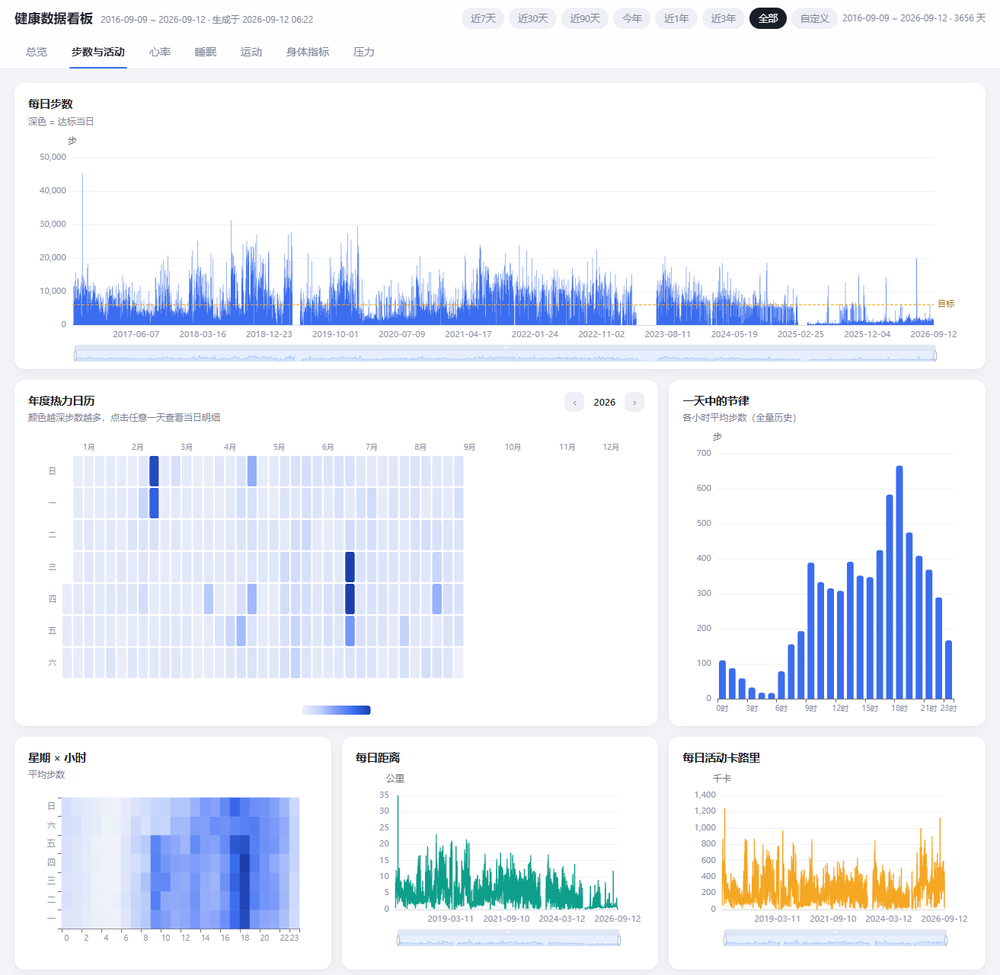

# 健康数据看板（MiHealth CSV Board）

一个**纯本地**的静态看板，把「小米运动健康」App 导出的 CSV 原始数据预处理后，用浏览器交互式浏览。无需联网、无需数据库、不上传任何数据。

## 预览



## 功能

7 个模块，覆盖每日汇总与分钟级明细：

| 模块 | 内容 |
|---|---|
| 总览 | 指标卡（步数/卡路里/睡眠/心率/压力/体重）、目标完成度、数据覆盖度、生涯统计 |
| 步数与活动 | 每日步数（目标线）、年度热力日历、一天中的节律、星期×小时、距离/卡路里/站立/强度 |
| 心率 | 静息心率（含 30 日均线与均值线）、心率区间带、心率摘要、区间时长堆叠 |
| 睡眠 | 睡眠时长（建议带 7–9h）、睡眠结构（深/浅/REM/清醒）、睡眠评分、作息节律散点 |
| 运动 | 类型分布、月度里程、跑步配速趋势、运动心率、可排序筛选的运动记录表（点击行查看单次详情） |
| 身体指标 | 体重趋势（BMI 区间）、VO₂max、血氧、PAI、活力时长 |
| 压力 | 日均压力（30 日均线）、压力构成堆叠、压力摘要、压力×睡眠质量 |

通用能力：日期范围切换（近7天 ~ 全部/自定义）、所有日期图支持滚轮缩放与底部缩放条、Y 轴带单位。

**单日钻取**：在任意日期轴图表上**点击某一天**（点在绘图区任意位置即可，无需精确点中柱子或折线），或在步数页点击热力日历的格子，即可弹出当日明细——含分钟级步数/距离、心率（标注睡眠时段）、压力、血氧四张图与当日指标卡片。四张分钟图均支持滚轮缩放与底部缩放条，可放大查看某小时的细节；拖动缩放/平移主图不会误触弹层。

**单次运动详情**：在运动页点击任意一条运动记录（或单日弹层里的运动条目），会弹出该次运动的详情：基础指标、心率区间时长、有氧/无氧训练效果、训练负荷与恢复时间、跑步形态（步频/步幅/触地时间/垂直振幅/垂直步幅比）、最快最慢配速与速度、爬升下降、单次 VO₂max、成绩预测（5km/10km/半马/全马）等。户外运动还会展示 **GPS 轨迹图**——以**免费卫星图（Esri World Imagery）为背景**叠加轨迹，从起点开始约 5 秒生长动画绘制到终点，悬停显示累计里程。

> GPS 轨迹来自导出包中的小米云 GPX 链接，预处理时会**联网下载**并解析（自动缓存到 `data/gpx/`，再次运行不重复下载；离线或下载失败则跳过，不影响其他功能）。链接带签名有时效，历史数据建议保留导出包随时可重新生成。
>
> 卫星图背景仅在打开轨迹弹窗时向 Esri 地图服务发起**一次网络请求**（会携带轨迹的大致范围）；网络不可用或加载失败时自动回退为纯轨迹图，其余功能保持完全离线。

## 数据从哪里下载

数据来自小米官方的数据导出功能：

1. 浏览器登录 [account.xiaomi.com](https://account.xiaomi.com/)
2. 进入 **隐私中心 → 管理您的数据 → 小米运动健康**，点击右侧的**下载**按钮
3. 等待小米生成导出文件（通过邮件或站内通知提供下载链接）
4. 下载得到压缩包，解压后是形如 `20260912_28826178_MiFitness_c3_data_copy` 的文件夹，内含几十个 CSV 文件和官方说明 PDF

> 导出包内包含账号信息，请注意保管，不要公开分享。

## 快速开始

```bash
# 1. 把解压出的导出文件夹放到本项目根目录（或任意位置，脚本支持手动输入路径）
# 2. 运行预处理（约 1 分钟）
python 数据预处理.py
#    也可以双击运行；或指定目录：
python 数据预处理.py "D:\下载\20260912_28826178_MiFitness_c3_data_copy"
# 3. 双击打开 index.html
```

预处理脚本会自动：探测/交互式询问导出目录、校验核心 CSV 是否存在、生成 `data/` 目录。
以后导出了新数据，重跑一次脚本刷新即可。

**环境要求**：Python 3.8+（需 pandas），现代浏览器（Chrome/Edge/Firefox）。

## 隐私

- 原始导出数据（含账号 ID）与预处理产物 `data/` **只在本地**，已写入 `.gitignore`，不会进入 git 仓库
- 看板完全离线运行，无任何网络请求、无统计埋点

## 目录结构

```
├── index.html            看板入口
├── css/style.css         样式
├── js/app.js             核心层：状态、图表挂载、范围切换、单日钻取
├── js/modules.js         7 个功能模块的图表配置
├── lib/echarts.min.js    ECharts（本地，无 CDN）
├── 数据预处理.py          CSV → data/ 预处理管道
├── data/                 生成产物（git 忽略）：daily/sports/hourly/meta/minutes
└── *MiFitness*/          小米官方导出的原始数据（git 忽略）
```

## 常见问题

- **打开 index.html 提示"数据文件尚未生成"**：先运行一次预处理脚本
- **脚本提示"未找到核心 CSV"**：确认输入的是解压后的文件夹（内含 `*_hlth_center_aggregated_fitness_data.csv`），而不是压缩包
- **某天的弹层提示"没有分钟级明细数据"**：当天手环没有记录分钟级原始数据（如未佩戴/未充电），只有每日汇总，属正常现象
- **想看最新数据**：App 里重新导出 → 重跑脚本 → 刷新页面
